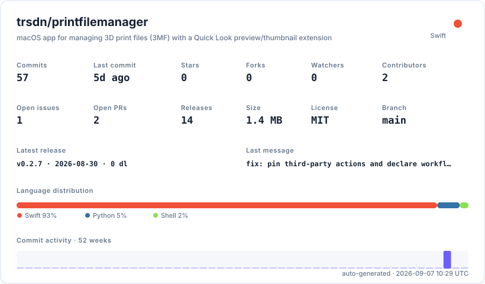

# Print File Manager

[](LICENSE)
[](#requirements)
[](https://github.com/trsdn/printfilemanager/actions/workflows/ci.yml)
[](https://github.com/trsdn/printfilemanager/releases/latest)
[](docs/self-assessment.md)

Local macOS tooling for large collections of `.3mf` 3D-printing files: a library manager that
indexes, searches and organizes them, plus a Quick Look plug-in that previews them in Finder.

Everything runs locally. Nothing is sent anywhere unless you explicitly turn it on.

## Repository layout

| Path | What it is |
|---|---|
| `printfilemanager/` | The **Print File Manager** app — indexing, search, tagging, previews, Auto Sort |
| `Quicklook/` | **3MF Quick Look** — Finder preview and thumbnail extensions plus their host app |
| `ThreeMFKit/` | Shared Swift package: 3MF package reading and preview extraction |
| `docs/` | Product requirements and dated review documents |

Both Xcode projects depend on `ThreeMFKit` as a local Swift package at `../ThreeMFKit`, so the
three folders must stay siblings.

## Installing

Download the latest signed build from [Releases](https://github.com/trsdn/printfilemanager/releases/latest):

| | |
| --- | --- |
| **Print File Manager** | the application |
| **3MF Quick Look** | Finder previews and thumbnails for `.3mf` files |

Both are notarized, so they open without a Gatekeeper warning. To confirm before opening:

```bash
spctl -a -vvv --type exec /Applications/PrintFileManager.app
# PrintFileManager.app: accepted
# source=Notarized Developer ID
```

Quick Look extensions only register once their host app has been launched once; see
[Installing the Quick Look extensions](#installing-the-quick-look-extensions).

## Requirements

- macOS 15 or later, Apple silicon or Intel
- Xcode 26 or later (Swift 6 language mode)
- [XcodeGen](https://github.com/yonaskolb/XcodeGen) — `brew install xcodegen`

Each project's `.xcodeproj` is generated from its `project.yml` and is also committed. After
changing `project.yml`, regenerate and commit the result:

```bash
cd printfilemanager && xcodegen generate
cd ../Quicklook  && xcodegen generate
```

## Build and test

CI runs on every push and pull request. `scripts/ci-local.sh` runs the same pipeline locally, plus
the two release checks that CI cannot perform, so a change can be validated before it is pushed:

```bash
scripts/ci-local.sh            # lint, package tests, both projects, conformance record
scripts/ci-local.sh --quick    # skip the Quick Look project
```

Or run the steps individually:

```bash
# Shared package
cd ThreeMFKit && swift test && cd ..

# Library manager
xcodebuild -project printfilemanager/PrintFileManager.xcodeproj \
           -scheme PrintFileManager -destination 'platform=macOS' test

# Quick Look extensions
xcodebuild -project Quicklook/ThreeMFQuickLook.xcodeproj \
           -scheme ThreeMFQuickLook -destination 'platform=macOS' test
```

## Installing the Quick Look extensions

Quick Look extensions only register once their host app has been installed and launched:

1. Take `ThreeMFQuickLook.app` from the [latest release](https://github.com/trsdn/printfilemanager/releases/latest),
   or build the `ThreeMFQuickLook` scheme in Release.
2. Move `ThreeMFQuickLook.app` to `/Applications`.
3. Launch it once.
4. Refresh the Quick Look registry: `qlmanage -r && qlmanage -r cache`.

Verify and debug with:

```bash
qlmanage -p some-model.3mf                          # render a preview
pluginkit -mAvvv -p com.apple.quicklook.preview     # confirm registration
```

Note that other applications — Bambu Studio, OrcaSlicer, PrusaSlicer — also claim the `.3mf` type,
and one of them will usually own it. The extensions therefore also register for `public.zip-archive`
so they are still offered in that case, and check at runtime that the archive really contains a 3MF
model part; any other archive is handed straight back to the system.

Extensions will not load on a machine other than the one that built them unless they are signed,
and macOS refuses to open an unnotarized download. Use `scripts/release.sh` for anything you intend
to hand to someone else — it archives both apps in Release, signs them with a Developer ID under
the Hardened Runtime, notarizes and staples them, and verifies the embedded extensions:

```bash
# Once, to store notarization credentials in the keychain:
xcrun notarytool store-credentials "printfilemanager" \
  --apple-id "you@example.com" --team-id "TEAMID" --password "app-specific-password"

TEAM_ID=TEAMID scripts/release.sh                # signed and notarized
TEAM_ID=TEAMID scripts/release.sh --skip-notarize  # signed only, for local checks
```

Artifacts land in `.release/`, which is gitignored.

For distribution the signing happens through
[macos-notarization-broker](https://github.com/trsdn/macos-notarization-broker), which builds from
a pinned commit in a secretless job and signs in a gated environment, so Apple credentials never
reach this repository. Both apps are onboarded there as the `printfilemanager` and `threemfquicklook` profiles.

Released artifacts are signed with `Developer ID Application: Torsten Mahr (G69Z5BNY97)`, built
with the hardened runtime, and notarized by Apple with the ticket stapled. Two local checks run
before a tag is cut, because the broker only validates bundle identity at signing time — far too
late to learn about a typo:

- `scripts/check-versions.sh` — both projects must declare the same full `X.Y.Z` version, and no
  `Info.plist` may hardcode one instead of referencing the build setting.
- `scripts/check-broker-profile.py` — the freshly built bundle must match the broker's profile
  (identifier, executable, package type, minimum system version, display name).

## Privacy

Both network features are **off by default** and are enabled independently in Settings:

- **AI enrichment** — sends the file name, its folder path, extracted metadata and, optionally, the
  preview image to an endpoint you configure. The endpoint must use `https` unless it is a local
  server. API keys are stored in the Keychain, never in preferences.
- **Web source lookup** — sends the project or file name to a web search engine and fetches the
  matching page from MakerWorld, Printables, Thingiverse or Cults.

The full `.3mf` file is never uploaded.

### What is stored, and for how long

The app keeps a library index and a preview store, both under `~/Library/Application Support`, and
API keys in the Keychain. Their exact paths are shown in **Settings → Your Data**.

Nothing is stored anywhere else, and nothing expires on its own — there is no retention period
because there is no server to retain anything on. Data lives until you remove it:

- Removing a scanned folder drops everything indexed from it.
- **Settings → Your Data → Delete All Data** removes the index and every stored preview. Your own
  model files are not touched.
- **Export Library** writes the whole index as plain JSON first, if you want a copy.

## Safety model

The original files are treated as valuable source artifacts:

- Auto Sort defaults to **Copy**; Move is a separate, explicit action.
- Every move, copy and rename is shown in a review sheet before anything touches the disk.
- Deletes go to the Trash, behind a confirmation.
- Destination paths proposed by an AI model are sanitized before use.
- Every batch produces a result report and can be undone with Cmd-Z: moves go back, copies are
  removed from the managed library, and originals are never deleted.
- If the library index cannot be read, it is preserved under a `.corrupt-<timestamp>` name and
  writes are blocked rather than overwriting it.
- The app runs in the App Sandbox. It can only reach folders you explicitly choose, and it keeps
  that access across launches with security-scoped bookmarks.

## Rolling back

Every release is a signed, notarized artifact that installs by drag-and-drop, so rolling back is
downloading an older one. Nothing in the app requires a matching version on disk.

1. Quit Print File Manager.
2. Download the previous release from [Releases](https://github.com/trsdn/printfilemanager/releases)
   and replace the copy in `/Applications`.
3. Confirm what you installed before opening it:

   ```bash
   spctl -a -vvv --type exec /Applications/PrintFileManager.app
   /Applications/PrintFileManager.app/Contents/MacOS/PrintFileManager --version 2>/dev/null \
     || defaults read /Applications/PrintFileManager.app/Contents/Info CFBundleShortVersionString
   ```

4. For the Quick Look extension, replace `ThreeMFQuickLook.app`, launch it once, then
   `qlmanage -r && qlmanage -r cache`.

The library index is versioned and migrated forward on load. A newer version may therefore write
an index an older version will refuse to read — it quarantines it as `*.corrupt-<timestamp>.json`
and blocks writes rather than damaging it. If you plan to move between versions, export the
library first from **Settings → Your Data → Export Library**; that JSON is plain and readable
independently of the app.

## Compatibility before 1.0

While the version is below 1.0 the interface is not stable, and minor releases may change
behaviour. Two guarantees hold regardless:

- **Your files are never the migration.** The app changes only its own index and preview store.
  Model files on disk are moved or copied solely through an action you confirm in a review sheet.
- **The index migrates forward, never destructively.** A readable older index is upgraded on load.
  An index that cannot be read is preserved under a `.corrupt-<timestamp>` name and writes are
  blocked, so a failed migration is recoverable rather than final.

From 1.0 onward, breaking changes to the index schema or to documented behaviour will require a
major version.

## Support status

Actively developed by a single maintainer as a personal project. Issues and pull requests are
welcome but carry no response commitment. See [SECURITY.md](SECURITY.md) for reporting
vulnerabilities privately.

## Repository stats

<picture>
  <source media="(prefers-color-scheme: dark)" srcset=".github/stats/repo-card-dark.svg">
  
</picture>

## Project conventions

The user-facing language is English and the app is English-only; there are no string catalogs and
no planned localization. Repository and contributor surfaces are English too.

Contributions, ownership and the validation commands are described in
[CONTRIBUTING.md](CONTRIBUTING.md). Automated agents should read [AGENTS.md](AGENTS.md) first.
Security reporting and the threat model are in [SECURITY.md](SECURITY.md).

This repository is assessed against the
[trsdn Repository Quality Standard](https://github.com/trsdn/.github); the current result is
**Healthy** — 78 pass, 0 partial, 0 fail, 6 not applicable — with the evidence in
[docs/self-assessment.md](docs/self-assessment.md).

## Documentation

- `CHANGELOG.md` — user-facing and operational changes
- `docs/self-assessment.md` — conformance evidence against the repository standard
- `docs/prd-3mf-library-manager.md` — library manager requirements
- `docs/prd-3mf-quick-look-preview.md` — Quick Look requirements
- `docs/app-review-2026-05-03-print-file-manager.md` — earlier product review
- `docs/assessment-2026-08-28-multi-agent.md` — current technical assessment and roadmap

## License

MIT — see [LICENSE](LICENSE).
